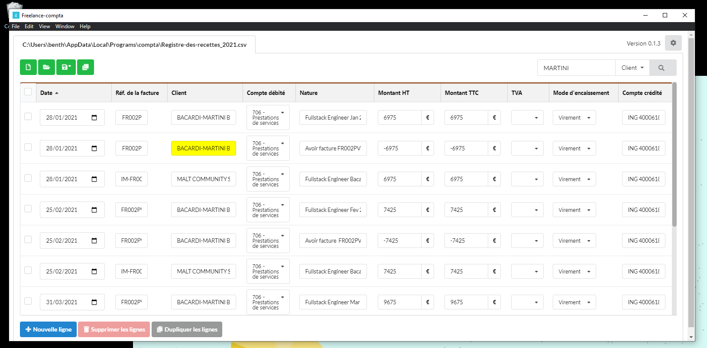

# Comptabilité pour Micro-Entreprise sous Linux et Windows

Logiciel de comptabilité minimal pour être **conforme à la réglementation française** des micro-entreprises BNC.
Les données sont enregistrées en CSV.
Idéal pour les freelances qui souhaitent une base simple (**React.js**) à customiser.



# Quick start

Télécharger la dernière release depuis [Github](https://github.com/freelance-info/freelance-compta/releases)

 - Windows: 
   - copier *freelance_compta.exe* dans un autre répertoire que *Téléchargements", par exemple le bureau.
   - exécuter le fichier; étant donné qu'il n'est pas signé, cliquer sur "en savoir plus" puis "exécuter quand même"
 - Linux exécuter l'AppImage ([?](https://docs.appimage.org/introduction/quickstart.html#ref-quickstart))

# Documentation utilisateur

## 1ère obligation légale : le _Livre des recettes_

Le fonctionnement reste très proche d'une feuille Excel avec :
- une aide à la saisie pour les clients / objets de prestation / mode de règlement
- une sélection de facture émises pour remplir automatiquement les lignes de compte

Référence sur le site du gouvernement:
https://www.service-public.fr/professionnels-entreprises/vosdroits/R54994

## 2ème obligation légale : le _Registre des achats_

Obligatoire uniquement pour les micro-entreprise de vente et de location.
Il fonctionne de la même façon que le livre des recettes et comporte une sélection de facture reçue.

## 3ème obligation légale : les _Factures émises et reçues_ 

Ce logiciel est fait pour fonctionner avec des factures émises de façon externes, par tout type de logiciel et notamment son cousin :
https://github.com/freelance-info/factures

Pour plus de souplesse, il se base sur un nommage des factures normé pour déduire la date, le client et le n° de facture.
Chaque ligne comptable lié à une facture conservera une référence vers le chemin du fichier.

## Les documents à produire

Déclaration 2035
Déclaration de TVA
Télé-transmission de la liasse fiscale à votre AGA

## Sauvegarde des données

Les données sont stockées sous forme de fichiers CSV, afin que vous puissiez les exploiter facilement avec un autre logiciel.
Vous pouvez aussi les sauvegarder très facilement sur le support de votre choix (dropbox, clé usb, etc.).
Selon votre volume d'activité, c'est vous qui choisissez comment découper vos fichiers : 1 fichier par mois, 1 fichier par année, etc.


# Développement

## En local

1. Installer [les pré-requis Python pour node-gyp](https://github.com/nodejs/node-gyp#Installation).

Exemple pour Windows : depuis un terminal en admin 

```
npm install --global --production windows-build-tools
```

2. Installer les dépendances : `npm install`

3. Linux: `npm run start` : lance en parallèle le front React (pour le livereload) et la fenêtre Electron 
Windows: lancer séparément `npm run start:electron-react` puis `npm run start:eletron-dev`


## Packaging

1. `npm run build:electron`: création des fichiers javascript de production

2. `npm dist:win`, `npm dist:linux` et `npm dist:mac` : création des exécutable d'installation

## Philosophie

Logiciel minimaliste mais méta-données et modèle de documents extensibles à volonté.

Logiciel standalone développé en Javascript (**reactjs** + **electron**), compatible Windows, Linux et Mac.

Ce qu'il a de plus que tous les autres ? 
Il fonctionne avec de simples fichiers CSV. Ce qui veut dire que vous pouvez à tout moment changer de logiciel très facilement.
De plus il les développeur pourront le personnalier facilement (stack la plus populaire, peu de code). Je vous encourage à le forker et à soumettre des Pull-Requests. 

Pensez à lui mettre une petite étoile si cette initiative vous plaît!


